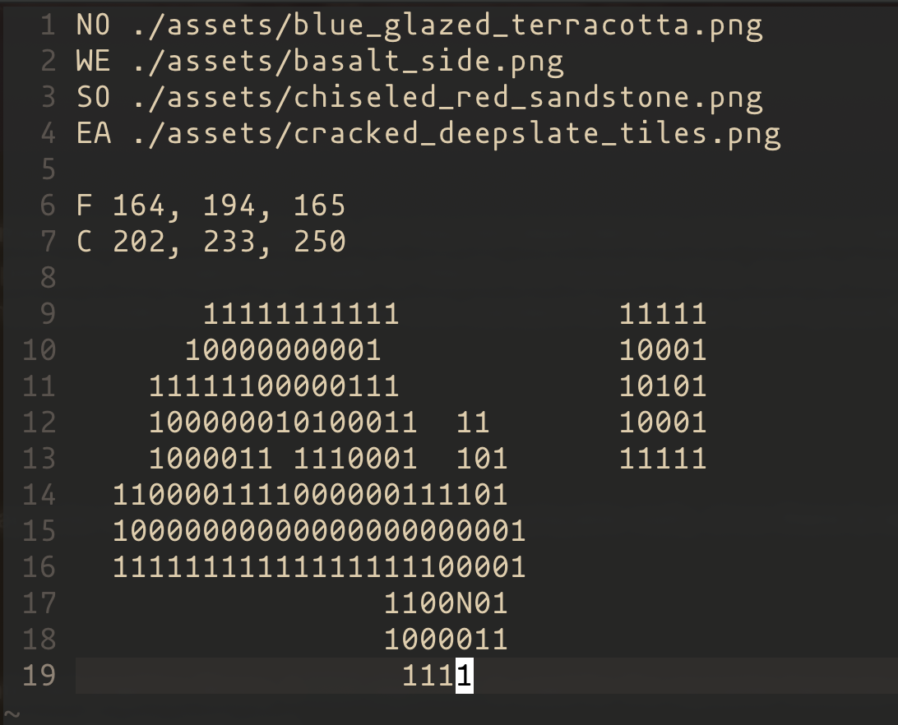

### Warning
This project uses the  graphics library, which means both glfw and OpenGL are required dependencies and CMake is needed to compile the library. Although the library itself is multiplatform, the project was made for MacOs and tested in Linux, so only those two are contemplated in the Makefile. Furthermore, some functions inside the Libft library use Unix standard libraries that aren't present in Windows.

## The Game
The aim of the project was the implementation of a raycaster in order to create a very simple (unplayable really, since **there is no gameplay**) Wolfenstein3D clone.

Everything is coded in C making use of the aforementioned graphics library. A ) is used for the raycaster because of it's precision and small number of cpu heavy operations, since the gpu isn't used.

Some features include:
- Linear key movement.
- Lateral camera rotation with keys.
- Lateral camera rotation with mouse.
- A minimap.
- Customizable ceiling and floor colours.
- Customizable wall textures.
- Customizable map.
- Wall collisions.

The map is designed in a '.cub' format and processed by a parser that ensures:
- Four textures are defined for the four wall orientations and no orientations are repeated.
- The floor and ceiling colours are defined once and given in rgb values that are valid.
- The map is completely enclosed by walls (char '1' in the map file, with '0' representing empty walkable space inside the map's walls).
- There is a single player (chars 'N', 'E', 'S' or 'W' depending on desired starting camera orientation).

### Controls
WASD - Four direction movement.  
Right/Left keys - Camera rotation.  
Mouse movement - Camera rotation.  
Esc - Close the game.  
That's it!

### Launching
The game must be launched from console and passed the path to the map file as the only argument.

### Acknowledgements
On resolutions bigger than the 800x600 default defined in the header file, the game starts laging when walls take certain amount of screen space, most likely due to the cpu intensive labor of painting each pixel manually.

And that's it! I'm pretty proud of this one too. It works properly and smoothly, the code is clean, the functions documented and you can never go wrong with Minecraft textures :D
