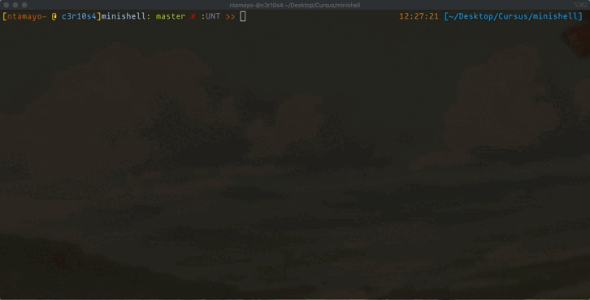
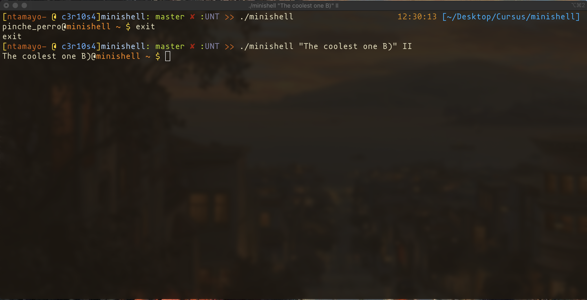

## Minishell
#### Just like Bash, but smol



Features of this great little thing include:
- A customizable promt that displays when waiting for a new command.
- Single and double quotes that work as they do in Bash.
- Variable expansion.
- A '?' variable that expands to the exit code of the last executed command.
- Redirections (<, <<, > and >>) and pipes (|).
- Signal overriding (Ctrl-C displays a new promt on a new line, Ctrl-\ does nothing, Ctrl-D exits the shell).
- A series fo builtins:
	- env
	- export
	- unset
	- pwd
	- cd
	- echo (with a working -n flag)
	- exit

### Compiling and launching
This project was made for use in 42's MacOs only and depends on the `readline` library installed via homebrew into `/Users/$USER/.brew/opt/readline`. So you'll need to install that and have a Mac if you want to try it at home.

That said, launching it is as easy as:
```bash
./minishell
```
Which will leave you with the default promt showed in the gif above.
A simgle argument can be passed (arguments other than the first will be ignored) to use it as the prompt :)


