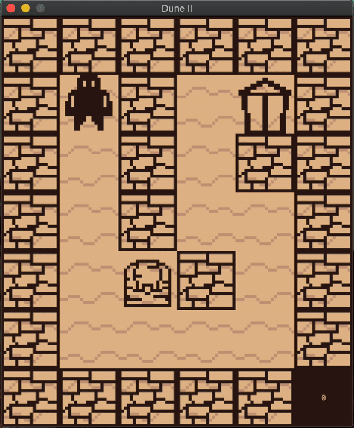
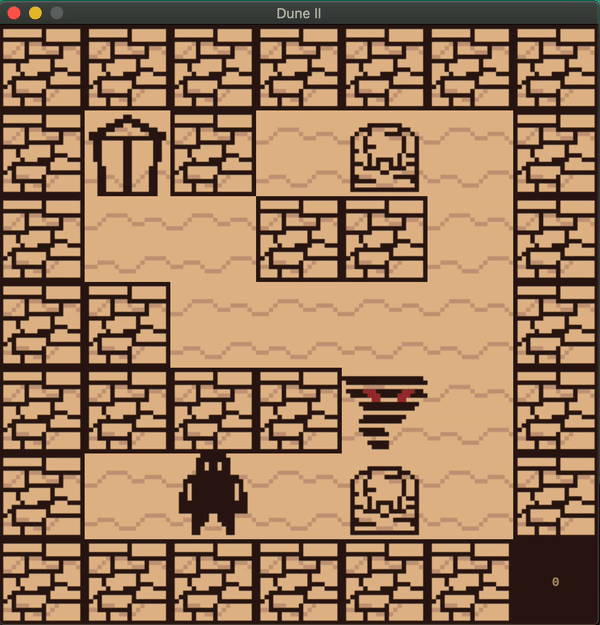
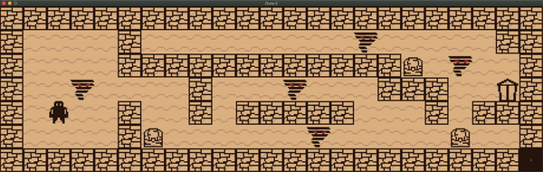

### Warning
This project can only be run on MacOs systems and relies on the minilibx graphics library, meaning both OpenGL and FrameKit are needed dependencies to compile and run.

## The Game
A tiny little desert themed game in which you must collect all chests before being able to exit de level, avoiding the dangerous sandstorms that lurk around the map.

It is a very small project coded in C with simple and limited graphics library. The levels are designed in a '.ber' format and processed by a parser that ensures:
- The map is completely enclosed by walls (char '1' in the map file).
- The map is rectangular.
- There is at least one collectible present ('C' char).
- There is a player and an exit and only one of each ('P' and 'E' chars respectively).

Enemies are optional and represented by the 'B' char in the map file. Their movement is exclusively horizontal and their initial direction of movement is determined by their position. They change direction upon encountering a tile they can't pass through and they will kill the player on contact.

The player's movement is restricted in a similar fashion, being only able to move to empty adjacent tiles. Attempting to move to a tile occupied by a chest will open it and count it as collected, attemping to do so again will succeed, efectively removing the opened chest from the game.

### Controls
WASD - Four direction movement.
Esc - Close the game.
That's it!
### Launching and playing
The game must be launched from console and passed the path to the map file as the only argument. After winning or loosing, the game is stopped and must be restarted manually.

And that is all folks! I hope you enjoy this minuscule little game, my first one ever too ^^.  
Everything in this repository except the mlx library has been done by me, sprites included. I'm proud of my work here :)
